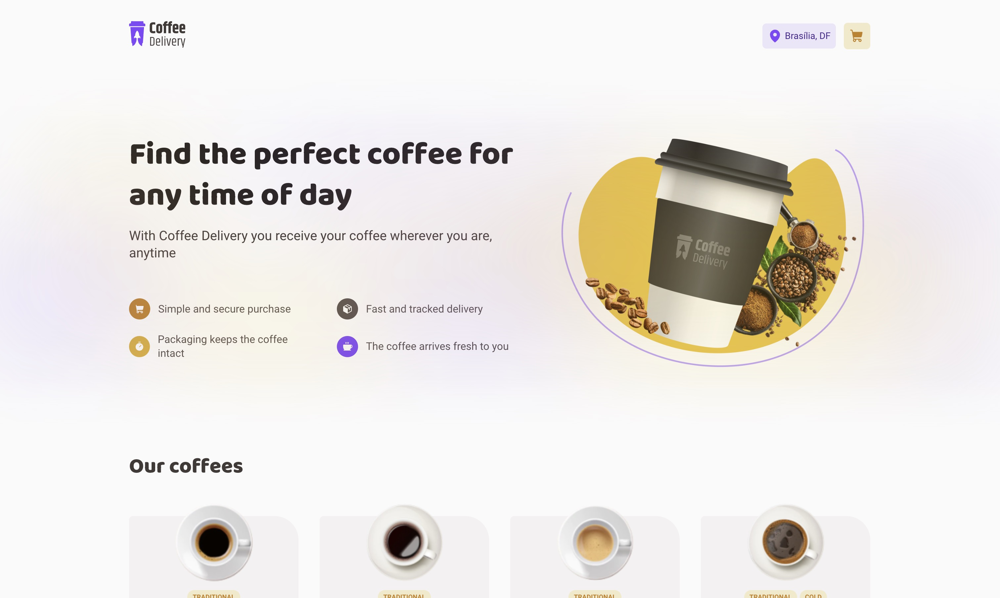
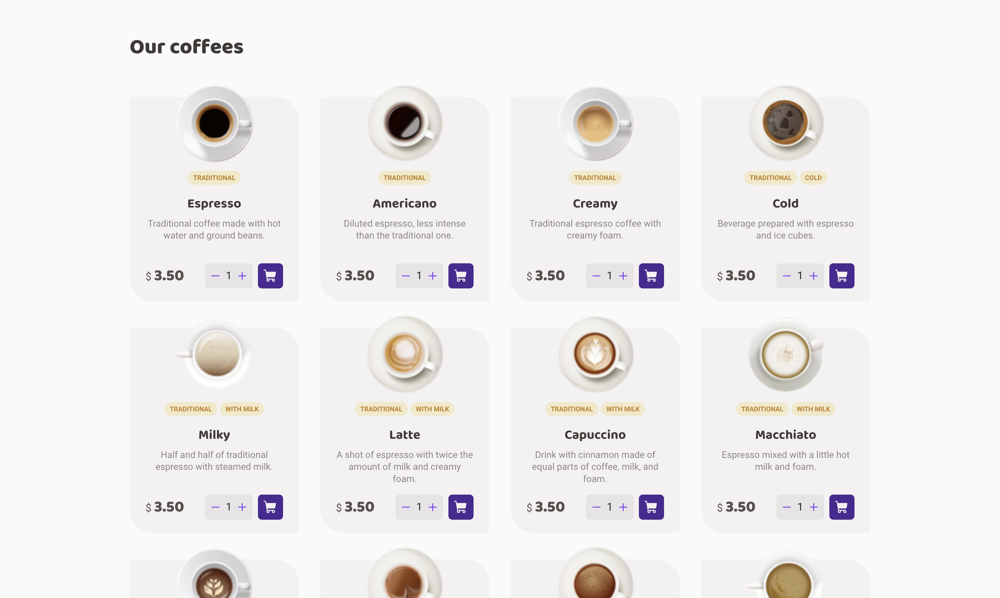
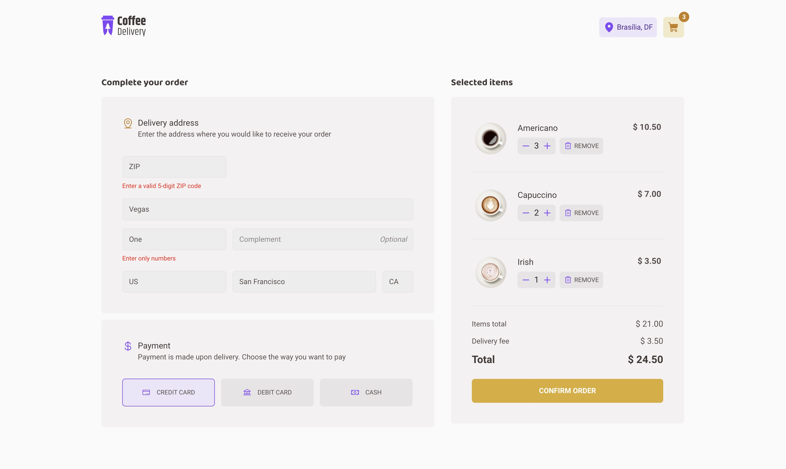
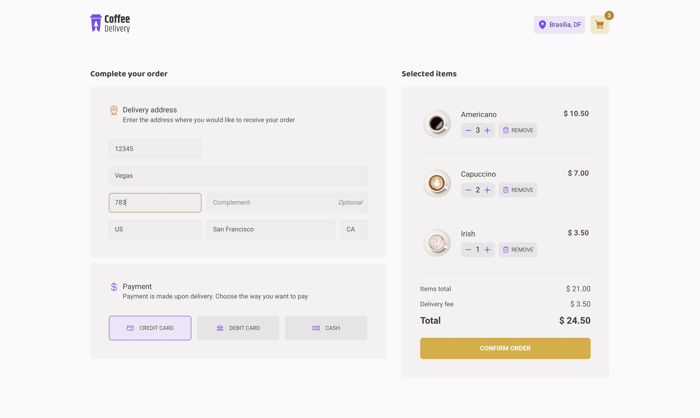
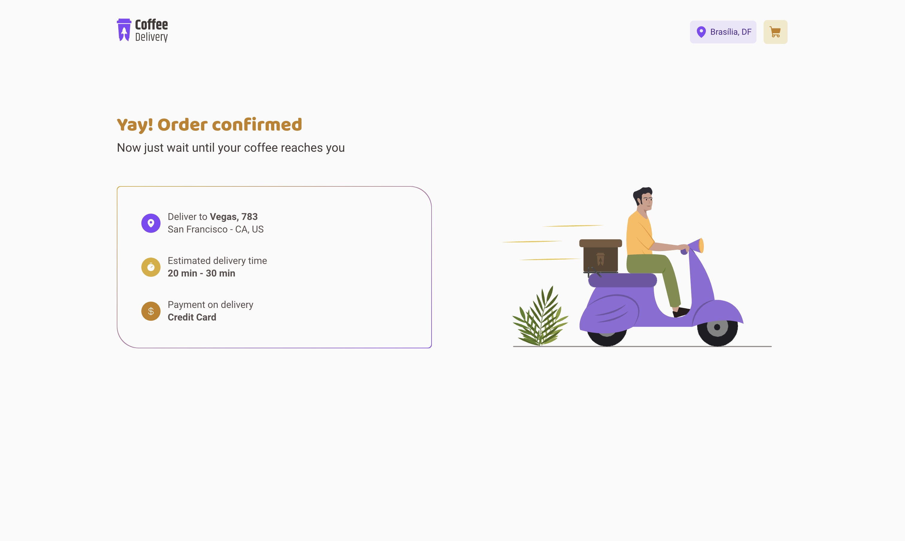

# Coffee Delivery - Web

## The App
A food delivery service for your favorite coffees any time of the day. 
Fill your address and choose your payment method. 
Add the coffees to cart, remove them, change quantity and confirm your order.

### Previews

  
  
  
  
  

### Techs
1. React
2. Typescript
3. Styled Components
4. React Router DOM
5. React Hook Form
6. Zod
7. Immer
8. Phosphor Icons

### Steps
1. Clone this repository;
2. Run your preferred command to install dependencies:
- `npm install`
- `yarn install` 
- `pnpm install` 
3. Run the app with: 
- `npm run dev`
- `yarn dev` 
- `pnpm run dev` 